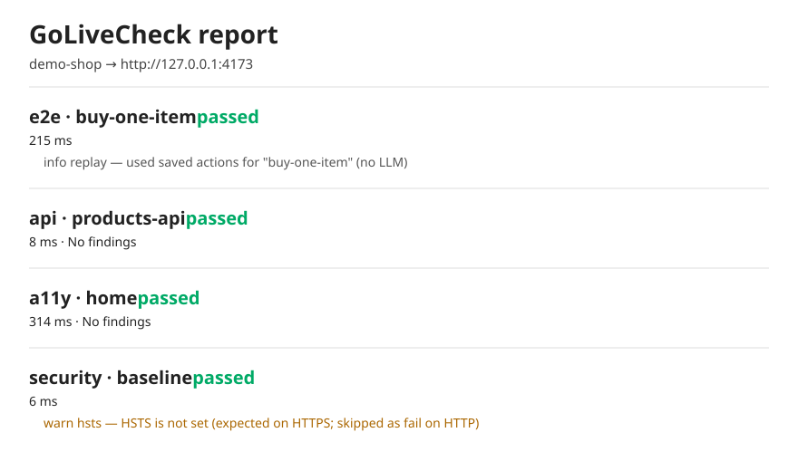

# GoLiveCheck

A testing agent another AI or a developer can call **before shipping**.

Point it at a site you own. In one run it checks:

1. User flow (English steps, optional AI)
2. API smoke
3. Accessibility (WCAG)
4. Safe security (headers, cookies, CORS — **no hacking**)

Then it writes **one report**: pass / fail and what to fix.

**Only scan systems you own or have permission to test.**



---

## Empty folder (Phase 4)

```bash
npm install golivecheck-agent
npx golivecheck-agent init
npx playwright install chromium
npx golivecheck-agent run --only security,a11y,api
npx golivecheck-agent report
```

Install the package first so `npx playwright` uses the same Playwright version the CLI depends on.

`init` writes `golivecheck.config.yaml` pointed at localhost. Change `target` / `allow` to a host you own before a live run.

Until the package is on npm, from a clone:

```bash
npm install
npm run build
node dist/cli.js init
```

---

## Two-minute demo (this repo)

```bash
npm install
npx playwright install chromium
npm test                 # no OPENAI_API_KEY required
npm run demo             # demo shop + all four jobs → output/report.html
npm run start:demo       # keep this running in another terminal (port 4173)
npx tsx src/cli.ts run --only security,a11y --config examples/suites/shop.yaml
npx tsx src/cli.ts report
```

---

## CLI

```bash
npx golivecheck-agent init
npx golivecheck-agent run --config golivecheck.config.yaml
npx golivecheck-agent run --only security,a11y,api
npx golivecheck-agent report
```

`--only security,a11y,api` works with **no** LLM key.

---

## Point it at a site you own

Copy `.env.example`. The owned host is the live website: [examples/suites/www.yaml](./examples/suites/www.yaml). Env-based cheap gate: [examples/suites/owned.yaml](./examples/suites/owned.yaml). Test login (no LLM) uses quoted Fill/Click steps so YAML `#ids` are not comments — see [examples/suites/login.yaml](./examples/suites/login.yaml).

```bash
npx golivecheck-agent run --only security,a11y,api --config examples/suites/www.yaml
# or
export GOLIVECHECK_TARGET=https://www.seethinajayadileep.dev
export GOLIVECHECK_ALLOW=www.seethinajayadileep.dev
npx golivecheck-agent run --only security,a11y,api --config examples/suites/owned.yaml
```

Suite strings may contain `${VAR}`. Missing vars fail the run. Do not scan hosts you do not own.

---

## GitHub Action (other apps)

Cheap PR gate — API, a11y, security; **no secrets required** beyond the target you own. Copy [examples/github/golivecheck.yml](./examples/github/golivecheck.yml). Pin `@v1` after the first release tag (see [examples/github/publish.md](./examples/github/publish.md)):

```yaml
- uses: seethinajayadileep/golivecheck@v1
  with:
    target: https://www.seethinajayadileep.dev
    allow: www.seethinajayadileep.dev
    only: security,a11y,api
```

`target` and `allow` are required. Default `only` is `security,a11y,api`.

---

## Cursor / MCP

After npm publish (or `npx -y golivecheck-agent`):

```json
{
  "mcpServers": {
    "golivecheck": {
      "command": "npx",
      "args": ["-y", "golivecheck-agent", "mcp"]
    }
  }
}
```

From a clone of this repo: [examples/cursor-mcp.local.json](./examples/cursor-mcp.local.json). Tools: `run_suite` (requires `target` + `allow`), `get_last_report`, `list_findings`.

---

## Status

Phase 4 is on `main`. Until `npm publish`, from a clone use `node dist/cli.js init`. Create and push tags `v1.0.0` and `v1`; publish with [examples/github/publish.md](./examples/github/publish.md). Skill notes: [SKILL.md](./SKILL.md).

- Build path: [ROADMAP.md](./ROADMAP.md)
- Day-1 coding order: [PLAN.md](./PLAN.md)
- Product walls: [IDEA.md](./IDEA.md)

---

## Read these if you are an AI

| File | Read when |
|---|---|
| [IDEA.md](./IDEA.md) | First. What we are building, who it is for, walls. |
| [ROADMAP.md](./ROADMAP.md) | Phases from spec → v0 → real app → npm. |
| [PLAN.md](./PLAN.md) | Exact day-1 build order. |
| [AGENTS.md](./AGENTS.md) | You will **implement or change** this repo. |
| [SKILL.md](./SKILL.md) | You will **run** GoLiveCheck for a user (CLI or MCP). |
| [PRODUCT.md](./PRODUCT.md) | Features, uniqueness, what we will not build. |

Do not invent extra product scope. If IDEA.md and the user disagree, **ask** — do not expand into pentest, mobile, or SaaS.

---

## CodeRabbit auto review

Config lives in [`.coderabbit.yaml`](./.coderabbit.yaml). Public repo with under 10 stars: comment `@coderabbitai review`. Setup: [CODERABBIT.md](./CODERABBIT.md).

---

## License

[MIT](./LICENSE)
